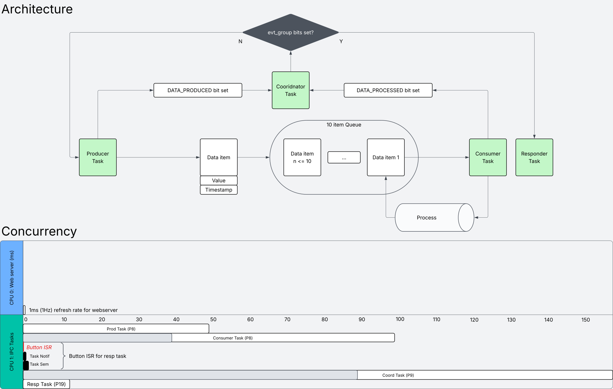

# rts-capstone - Real-Time Systems Final Capstone

## Theme
A real-time system that works, built to demonstrate attitude process delays and how it affects queues for an avionics role.

## Demo
- Video: <YouTube / Wokwi link>
- Live Wokwi: ELHAOUAJI-FINAL-RTS26Summer (https://wokwi.com/projects/471033187914654721)

## Architecture

Data flows from production task to consumer task through a 10 item queue. The queue's overflow policy is dropping the incoming packet until the queue depth has decreased. The coordinator and responder tasks are linked the task notifications, where the coordinator processes the bits set by production and consumer tasks to give the task notification to the responder.

## Tasks & timing (WCET evidence)
| Task |  BCET B  | WCET W | VET=B/W | Priority | 
|------|---------:|-------:|--------:|---------:|
| Prod |   50ms   |  50ms  |    1    |     8    |    
| Cons |   40ms   |  100ms |   0.4   |     8    |
| Cord |   90ms   |  150ms |   0.6   |     9    |
| Resp |   90ms   |  150ms |   0.6   |    12    |

Avg execution time variation = 0.65
Where towards 1 means execution time tends to be consistent with BCET and toward to 0 means execution time varies widely between BCET and WCET. This does not mean the rate of variation for ET, but the overall magnitude of difference with respect for the ETs.

## Hazard analysis & standard mapping
<hazard, effect, mitigation; mapped to the standard clause>

## Graceful degradation
<what fails, how it is detected, what the system does instead>

## Build & run
This does not require a physical baord, but is simulated on the esp32-s3-devkitc-1. There are two builds to choose from depending on if you only want a serial monitor or web monitor. For a serial monitor, please use the wokwi code which can be found in the firmware/wokwi folder. Simply create an account on wokwi.com, select the correct board (all the board and wiring specifications are in the .json file), and import the main.c src file and .json file. 

An advanced version on VScode is the only recorded method to get the web server to work. To do this, follow the steps on https://randomnerdtutorials.com/vs-code-platformio-ide-esp32-esp8266-arduino/ to get the Platform IO extension installed and working. Then download the Wokwi Simulator extension, build the project with the imported .c and .json, and link the .bin and .elf files from the .pio board folder into the Wokwi .toml file (all the files you need are located in the firmware folder under vscode titled "App1"). At this point the simulator is runnable, but you still need to connect to the IoT server. To do this, you need to download an IoT gateway from Wokwi at https://github.com/wokwi/wokwigw. Once this is done run the wokwigw.exe and make sure the terminal says it is listening on a port (should be port 80). After this run the code and you should see a WiFi symbol with a lock next to it. This means the connection is established and you can access the server html at http://localhost:9080/ (or whichever port you set it to).

## Tailored for
Those in the avionics role. This is because the wokwi simulation depicts how attitude packets can be dropped from queue, and the flow of all four tasks for data and communications.
